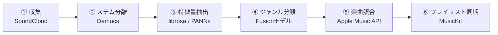

# EDMサブジャンル自動判定システム — システム仕様書

## 概要

SoundCloudからEDMトラックを自動収集し、ステム分離（ドラム/ベース/サブベース/メロディ代理）ごとに音響特徴量を抽出、マルチブランチ融合モデルでEDMサブジャンル（Tear Out, Riddim等）を確率付きで判定し、Apple Musicプレイリストへ自動同期するエンドツーエンドのパイプラインシステム。

## パイプライン全体像

## 技術スタック

| レイヤー | 技術 | 用途 |
|---|---|---|
| 言語 | Python 3.11 | 全モジュール |
| DB | SQLite | トラックメタデータ・分類結果の永続化 |
| ステム分離 | Demucs (htdemucs) | drums / bass / vocals / other に分離 |
| 帯域分割 | scipy.signal (Butterworth) | bass → bass + subbass |
| 特徴量抽出 | librosa | オンセット、テンポ、MFCC、スペクトル特徴等 |
| 音響埋め込み | PANNs (Cnn14) | other ステムの汎用音響表現 |
| 分類モデル | scikit-learn / XGBoost | ロジスティック回帰 / GradientBoosting / XGBoost |
| 確率較正 | CalibratedClassifierCV | sigmoid法による確率補正 |
| 楽曲照合 | Apple Music API + AudD | テキスト照合 → フィンガープリントフォールバック |
| テキスト類似度 | rapidfuzz | タイトル/アーティスト名の曖昧マッチ |
| プレイリスト同期 | MusicKit API | Apple Musicプレイリストへの曲追加 |
| 音源ダウンロード | yt-dlp | SoundCloudからの音源取得 |

## ジャンル定義（MVP）

| ラベル | 説明 |
|---|---|
| `tearout` | Tear Out Dubstep — アグレッシブなベースデザイン、高速テンポ、複雑なリズムパターン |
| `riddim` | Riddim Dubstep — 反復的なサブベースワブル、ミニマルな構成、LFOパターンの周期性 |

> **拡張計画:** MVPは2値分類。将来的にColor Bass, Briddim, Melodic Dubstep等を追加予定。

## 設計原則

### track_id の生成規則
- `sha256(source_url)` の先頭16文字（hex）
- 同じ曲を再取得しても同じIDになる（冪等性）

### 冪等・再実行可能な設計
- 各スクリプトは `*_at IS NULL` のトラックだけを処理
- 完了したら該当カラムにタイムスタンプを書き込む
- cronでの定期実行を前提

### エラーハンドリング
- 失敗したトラックはクラッシュさせず、ログに記録してバッチ処理を継続
- 失敗したトラックは次回実行時に再試行対象として残る

## DBスキーマ

### tracks テーブル

| カラム | 型 | 説明 |
|---|---|---|
| track_id | TEXT PK | sha256(source_url)[:16] |
| source | TEXT | 収集元（例: "soundcloud"） |
| source_url | TEXT UNIQUE | 元のURL |
| title | TEXT | 楽曲タイトル |
| artist | TEXT | アーティスト名 |
| raw_audio_path | TEXT | ダウンロード済み音源のパス |
| drop_start_sec | REAL | ドロップ開始位置（秒） |
| drop_end_sec | REAL | ドロップ終了位置（秒） |
| separated_at | TIMESTAMP | ステム分離完了時刻 |
| features_extracted_at | TIMESTAMP | 特徴量抽出完了時刻 |
| classified_at | TIMESTAMP | 分類完了時刻 |
| apple_music_id | TEXT | Apple Music上の楽曲ID |
| identified_at | TIMESTAMP | 楽曲照合完了時刻 |
| sync_status | TEXT | 同期状態（synced / no_match） |
| synced_at | TIMESTAMP | プレイリスト同期完了時刻 |
| created_at | TIMESTAMP | レコード作成時刻 |

### genre_probabilities テーブル

| カラム | 型 | 説明 |
|---|---|---|
| id | INTEGER PK | 自動採番 |
| track_id | TEXT FK | tracks.track_id への外部キー |
| genre_label | TEXT | ジャンルラベル（tearout / riddim） |
| probability | REAL | 予測確率（0.0〜1.0） |
| model_version | TEXT | 使用したモデルバージョン |
| created_at | TIMESTAMP | レコード作成時刻 |

## 特徴量設計

### drums ブランチ
- オンセット強度包絡 → テンポ推定、オンセット密度
- 自己相関の上位3ピーク（lag + 強度）→ リズムパターンの反復性

### bass ブランチ
- メルスペクトログラム（mel bin方向 mean/std）
- スペクトル重心・ロールオフ・バンド幅（mean/std）
- MFCC 13次元（mean/std → 26次元）

### subbass ブランチ（分類の鍵）
- RMSエネルギー包絡 → 自己相関 → 支配的周期（LFO周期の推定）
- ワブル/リディムパターンの周期性がTear OutとRiddimを分ける主要特徴

### other ブランチ
- PANNs Cnn14 埋め込みベクトル（汎用音響表現）
- Chroma STFT（mean/std）→ 調性/メロディの補助特徴

## 分類モデル設計

- **入力:** 4ブランチの特徴をブランチごとにStandardScaler → concat
- **候補モデル:** LogisticRegression / GradientBoosting / XGBoost
- **評価:** 5-fold StratifiedKFold（accuracy, F1, 混同行列）
- **確率較正:** CalibratedClassifierCV（sigmoid法, cv=5）
- **出力:** `{"tearout": 0.8, "riddim": 0.2}` 形式の確率辞書

## Apple Music連携

### 楽曲照合（2段階フォールバック）
1. **テキスト照合:** title + artist で Apple Music Catalog Search → rapidfuzzスコア ≥ 85 なら採用
2. **フィンガープリント照合:** AudD API にドロップ区間の音声クリップを送信

### プレイリスト同期ルール
- ジャンル × 最低確率の条件を設定ファイルで定義
- 条件に合致 → 対象プレイリストに追加
- 条件不一致 → `sync_status = 'no_match'`

## 設定パラメータ

| パラメータ | 値 | 説明 |
|---|---|---|
| sample_rate | 44100 | サンプリングレート |
| subbass_cutoff_hz | 120 | bass/subbass帯域分割カットオフ |
| drop_segment_seconds | 18 | ドロップ検出ウィンドウ幅 |
| genre_labels | [tearout, riddim] | 分類対象ジャンル |
| model_version | v0.1 | 現在のモデルバージョン |
| request_delay_sec | 3 | API リクエスト間スリープ |
| max_concurrency | 2 | 同時ダウンロード数上限 |
| min_follower_count | 500 | アップローダーフィルタ閾値 |
| text_match_min_score | 85 | rapidfuzz照合閾値 |
| min_probability | 0.6 | プレイリスト同期の最低確率 |
